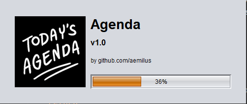
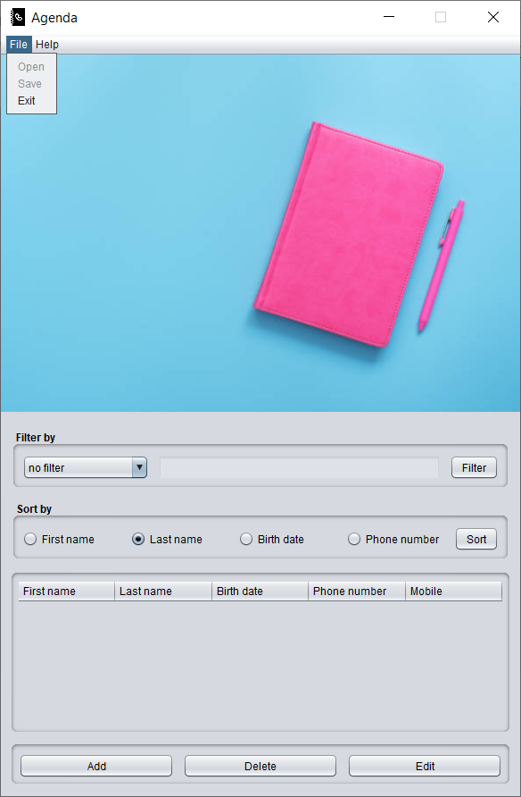
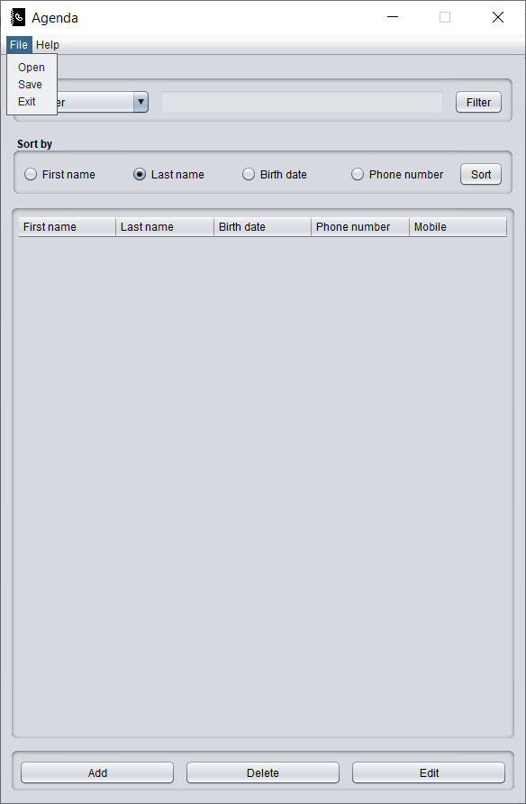
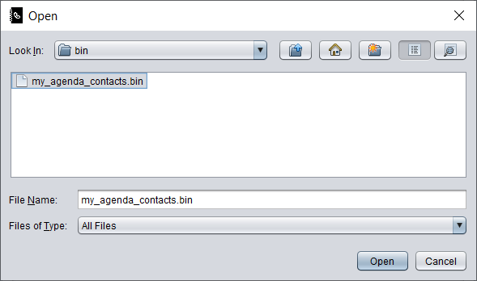
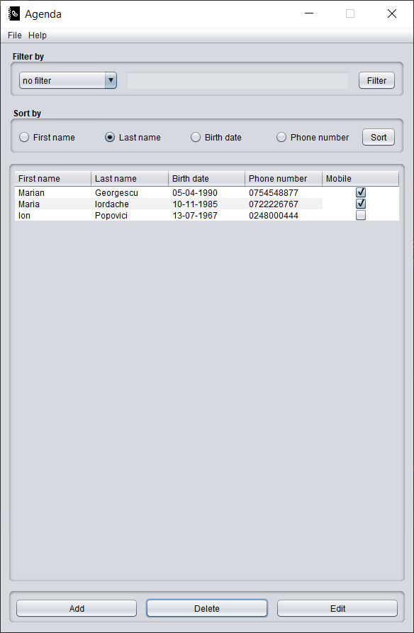
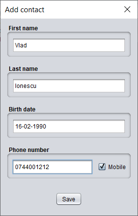
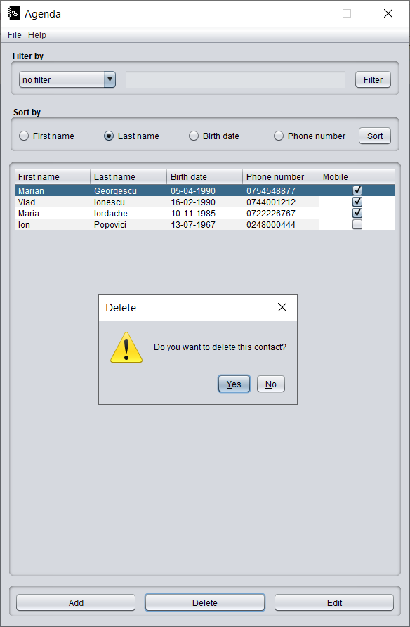
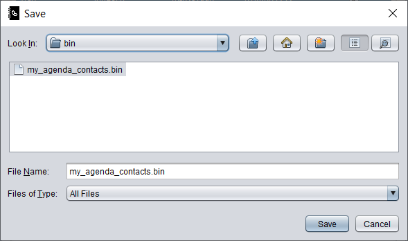

# Final Project
- Build a complex contacts agenda application.
  Application will start initially in "shareware" mode
  with limited features enabled, and a "slideshow" commercials zone.
  When the user will enter a valid registration code, 
  all features will be enabled, and the commercials will clear.
  
## Requirements

### `Contact` class
  - fields: `firstname`, `lastname`, `phonenumber` (which can be of type `Mobile` or `Fixed`) and `birthdate`
  - user input is validated:
    - `firstname` and `lastname` should have two letters at least
    - `birthdate` should be in format `dd-MM-yyyy`
    - `phonenumber`
      - must have 10 digits
      - `Mobile` phone numbers start with `07`
      - `Fixed` phone numbers start with `02` or `03`
  - duplicate `Contact` objects will not be allowed;
  two `Contact` objects are identical if all their fields value are equal

### Operations
- User will be able to add, edit, delete, sort, filter, save and load contacts.
  - when a new `Contact` object is to be added, but it is a duplicate, then throw an exception and inform the user
  - `Contacts` filtering can be done in two ways
    - based on predefined filters
      - only `Contact`s with `Fixed` phone numbers
      - only `Contact`s with `Mobile` phone numbers
      - only `Contact`s having `birthday` today
      - only `Contact`s having `birthday` this month
    - a custom filter where `Contact`s are filtered based on user input;
    the search will be over all `Contact` fields except `birthdate`

### Graphical interface
- when the application starts a `SplashScreen` (loading screen) 
  will be displayed with a progress bar loading for 1-2 seconds
  and information about the author/developer, then the main application frame is displayed
- the main application frame will contain
  - a list of contacts displayed in a table
  - a `SlideShow` of commercials
  - buttons for performing the operations described above
  - a menu bar with the following
    - `File` menu
      - `Open` menu item for loading a `Contacts` list from the filesystem
      - `Save` menu item for saving the list of `Contacts` on filesystem
      - `Exit` menu item
      - `Open` and `Save` menu items are disabled initially
    - `Help` menu
      - `Register` menu item for entering a registration code;
      if the code is valid then 
        - `Register` menu item is disabled
        - `Open` and `Save` menu items are enabled
        - `SlideShow` commercials are removed
    - `About` menu item displays a pop-up with info about author/developer
  
### Result of current implementation

