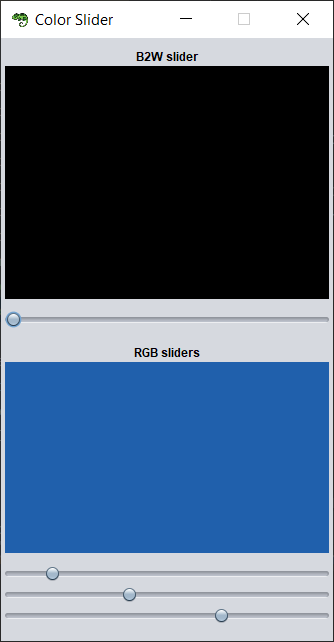

Exercise 01
- Create a GUI application where you use a ``JSlider`` to change the background color of a ``JLabel`` from black to white.
- Extend the application by adding three ``JSlider``s to change color in RGB model.

Snapshot with result of my implementation:

