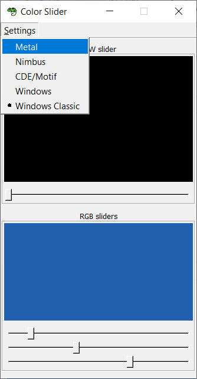

Exercise 02
- Extend application from [Exercise 01](https://github.com/Aemilus/Fundamentals_of_JAVA_Programming/tree/master/src/me/academy/javaprogrammer/week07/exercise01) by:
    - build an array of supported Look and Feels
    - for each look and feel build a radio button menu item ``JRadioButtonMenuItem``
    - create a menu bar and group this menu items under a **Settings** menu
    - whenever user selects a look and fell from **Settings** menu then update the GUI components to selected look and feel
    - the look and feel used at startup of application must be selected by default in **Settings** menu

Snapshot with result of my implementation:

