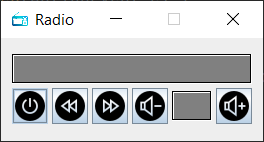
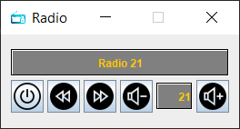

Exercise 03
- Build a GUI for the radio device created in Week 03 [workshop](https://github.com/Aemilus/Fundamentals_of_JAVA_Programming/tree/master/src/me/academy/javaprogrammer/week03/workshop):
    - power button icon to change on power on/off
    - ``JLabel`` for displaying current radio station
    - ``JLabel`` for displaying current radio volume
    - buttons for changing the radio station and the volume with custom icons
    
Screenshot with result of my implementation:

