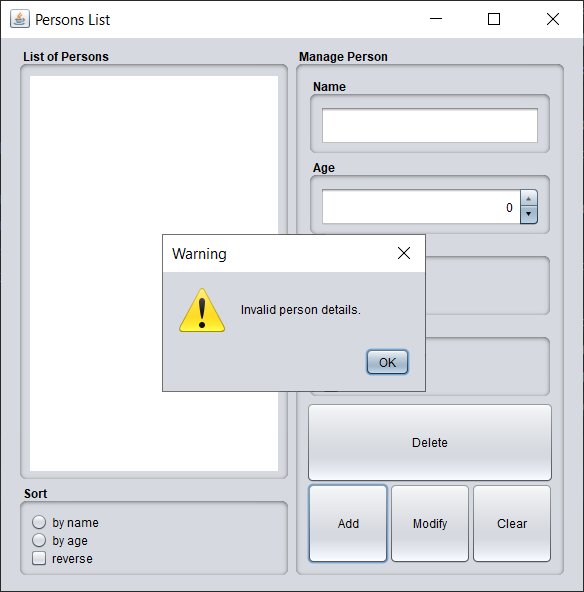
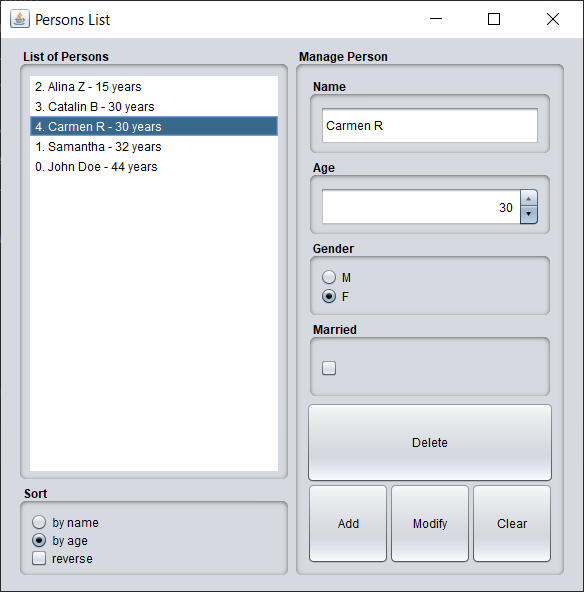

Exercise 01
- Build an application with graphical user interface which displays a list of persons and allows the user to sort it by age or name in ascending or descending order.

Requirements:
- build a `Gender` enum for male and female
- build `Person` class:
    - fields: `name`, `age`,`gender`, `married`
    - it implements `Comparable` and the comparison will be by `name` field
    - methods:
        - a private constructor with 4 arguments (the fields above)
        - override `toString()` method; to be later used in displaying the persons in the `JList`
        - getters and setters
        - static `getInstance()` - validate the arguments and  if valid return a new `Person` else `null`
- build a `PersonsListFrame` class:
    - it extends `JFrame`
    - mandatory fields:
        - a`JList` to display a list of `Person` objects
        - a list `List<Person>` collection
        - a model for this list `DefaultListModel<Person>`
        - a `Comparator<Person>` to sort by age
        - `JTextField` for name input
        - `JSpinner` for age input
        - `JRadioButton`s for selecting gender
        - `JCheckBox` for marital status
        - `JButton`s for adding, modifying, deleting persons in list and clearing the user input
        - `JRadioButton`s for sorting by name or age
        - `JCheckBox` for reverse sorting depending on what `JRadioButton` is selected
            - when checked the list is sorted in ascending order
            - when unchecked the list is sorted in descending order
    - all `ActionListeners` are written with lambda expressions
    - show a message dialog when an exception occurs as result of invalid input `JOptionPane.showMessageDialog()`
    
Result of current implementation:

