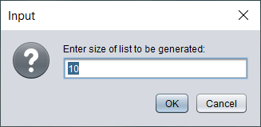
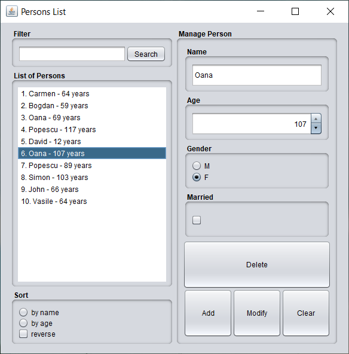
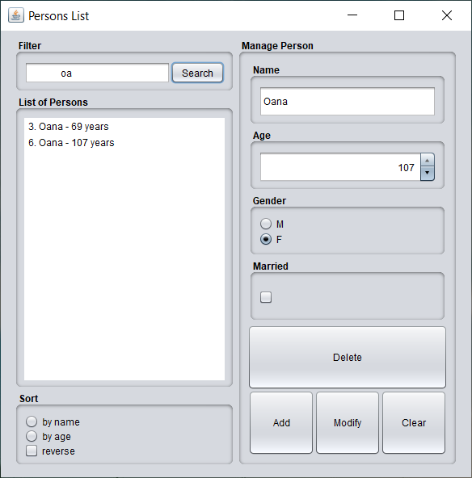

Exercise 01
- Extend application [Week08/Exercise01](../../week08/exercise01) by:
    - modify the constructor of `Person` class to validate the arguments and throw exceptions if invalid arguments are detected
    - build a helper class `PersonGenerator`:
        - a constant String array of person names
        - static method `generatePerson()` to return a `Person` object generated with random `name`, `age`, `gender` and `married` fields
        - static method `generatePersonList(int size)` to return a list of `Person` objects; make use of `Stream.generate()` and `limit()` to stop the generation when the list if populated with `size` `Person` objects
  - when application starts, an input dialog box is displayed to read a positive integer value `size`; populate the `JList` with `size` randomly generated `Person` objects
  - when user double clicks a `Person` in the `JList` the fields values are loaded on the `JPanel` where `Person` can be modified
  - on gui add a `JButton` called `Search`
  - add a `JTextField` where user can enter text for searching in the list if there are `Person`s having `name` field containing the search text; the search is launched on press of `Search` button; the search is case-insensitive and leading or trailing blanks are removed
  - on `Clear` button press the `JTextField` is cleared and the `Jlist` is refreshed
    
Result of current implementation:

