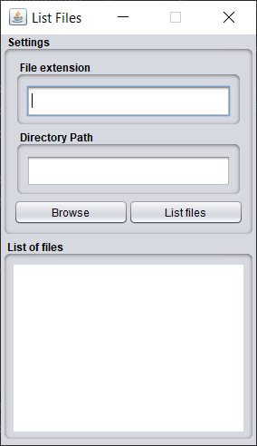
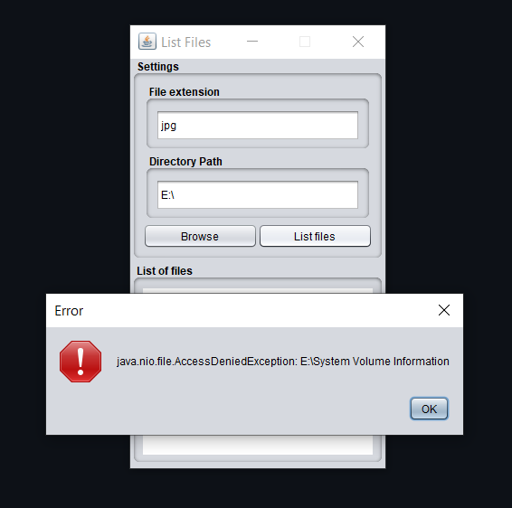
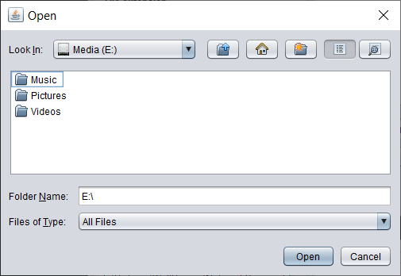
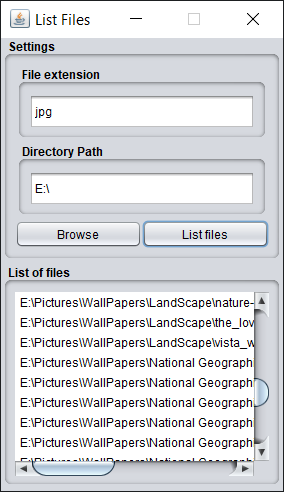

Exercise 01

- List all files with a given extension in a given directory and all it's subdirectories.

For example: list all JPG files in users Picture directory and subdirectories.
  
Result of current implementation:

