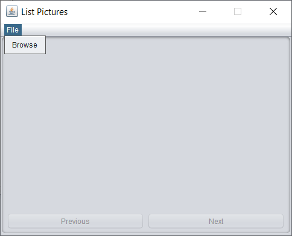

Exercise 03

- Build a GUI application to display the pictures in a directory.

Requirements:
- GUI has a `JMenuBr` with `File` `JMenu` and `Browse` `JMenuItem`
- on `Browse` `JMenuItem` press a `JFileChooser` is opened to choose a directory
- build a `List` with all pictures placed in that directory
- display one picture at a time from this `List` in a `JLabel`
- user can navigate through these images by pressing on `Next` and `Previous` `JButtons`

Result of current implementation:

