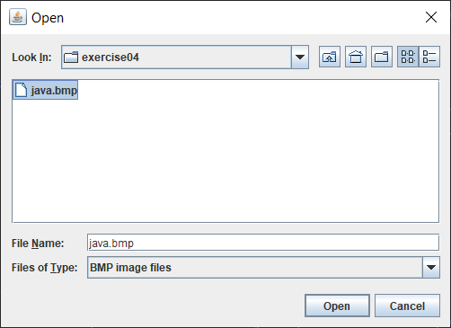
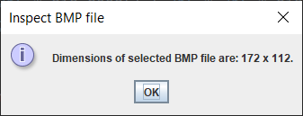

Exercise04
- Open a BMP file and read its dimensions.
  The width is stored on 4 bytes in little-endian placed after first 18 bytes.
  The next 4 octets in little-endian represent the height.
  
Requirements:
- user selects the BMP file from a `JFileChooser` that is displayed at startup
- the `JFileChooser` must have a filter so that user can only select BMP file types.
- user is able to select only one file
- the dimensions of selected file are displayed in a `JOptionPane`

Result of current implementation:

