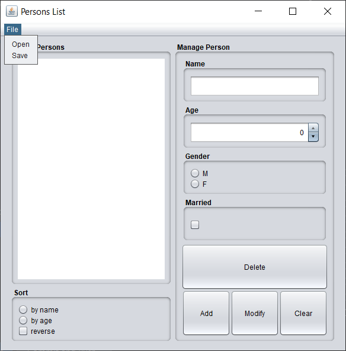
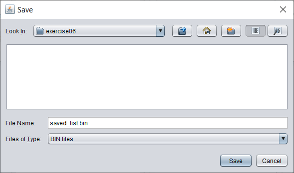
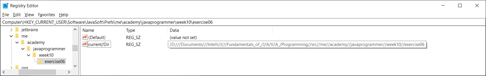
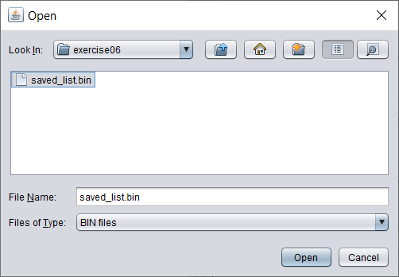
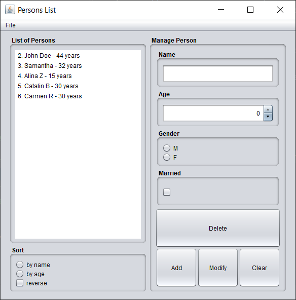

Exercise06
- Improve application from [Week08/Exercise01](../../week08/exercise01) and add a `FIle` `JMenu`
  with `Open` and `Save` `JmenuItem`s to load and save the list of persons.
  
Requirements:
- class `Person` needs to be `Serializable`
- the last location where user saved or opened a file
  should be saved persistently via Preferences API.
  
Result of current implementation:

