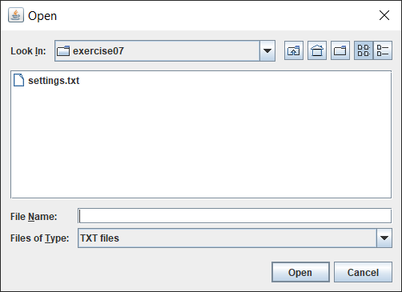
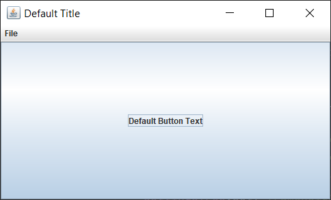
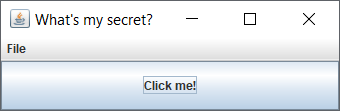
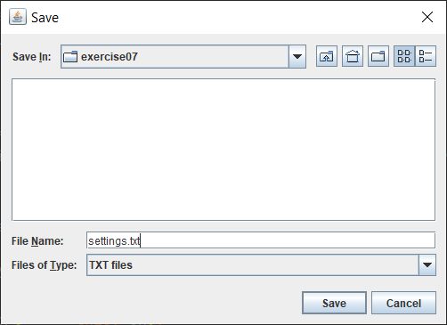
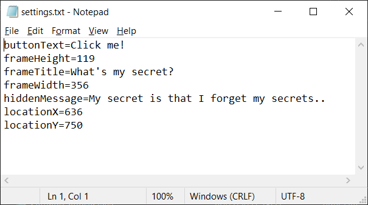

Exercise07
- Build a GUI application whose settings are saved in a text file
  which contains a list of `key=value` pairs one per line.
  
Requirements:
- when application is launched the user is prompted
  to select the file containing these settings;
  if user doesn't select the file then the GUI is created with default settings
- user is able to export the current GUI settings to a file
- the `JFileChooser` used for importing or exporting the settings 
  should remember the last directory visited;
  use Preferences API to store persistently the directory path
  
Result of current implementation:

