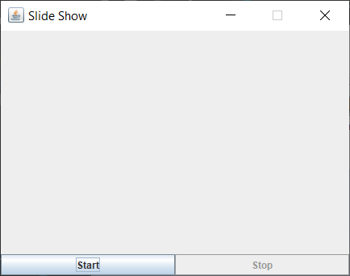
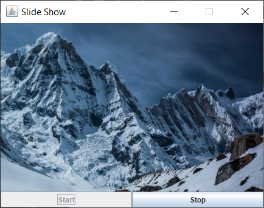
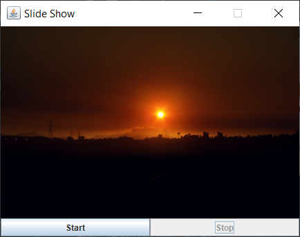

Exercise01
- Build a GUI application where a list of images is displayed 
  in a slide-show manner at fixed display rate. 
  User is able to start and stop the "slide-show" at any time.
  
Result of current implementation.

