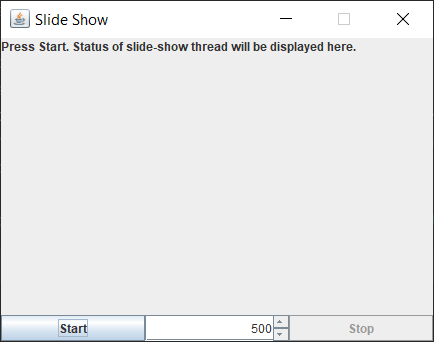

Exercise02
- Build a GUI application where a list of images is displayed
  in a slide-show manner at a variable display rate.
  User is able to start and stop the "slide-show" at any time.
  User is able to change the display rate at any time, and 
  the display rate change takes effect on the go 
  (without stopping or restarting the slide-show thread).
  
Result of current implementation:

