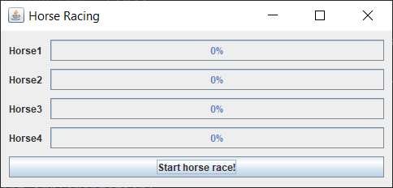
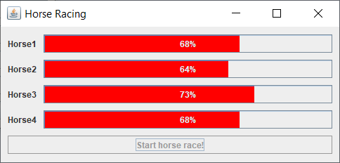
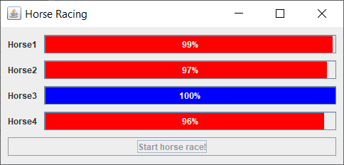
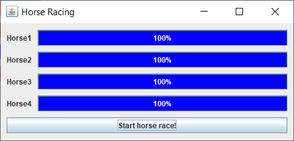

Exercise03
- Build a GUI application which simulates a horse race.

Requirements
- build `HorsePanel` class 
    - it extends `JPanel` and implements `Runnable`
    - `JLabel` field for horse name
    - `JProgressBar` field for displaying the horse's progress to finish line
    - also display the progress in percentage
    - while the horse is racing the `JProgressBar` color is red
    - when the horse reaches finish line the color is set to blue
- build `HorseRacingFrame` class
    - it extends `JFrame`
    - has a constant field to record number of horses participating in the race
    - has a field with `List` of `HorsePanel`s 
    - put each `HorsePanel`s in a `GridLayout` one below the other
    - `JButton` to start the race
      - for duration of race `JButton` is disabled
      - when the race has ended `JButton` is re-enabled
    
Result of current implementation:

