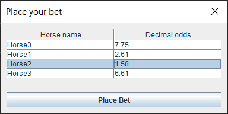
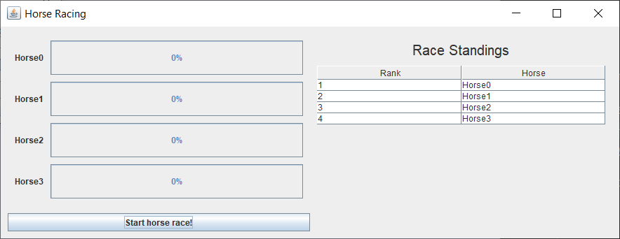
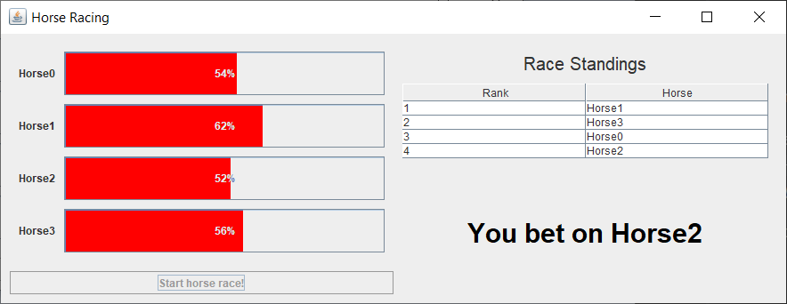
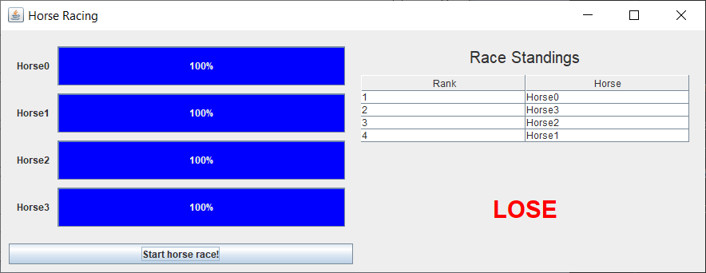
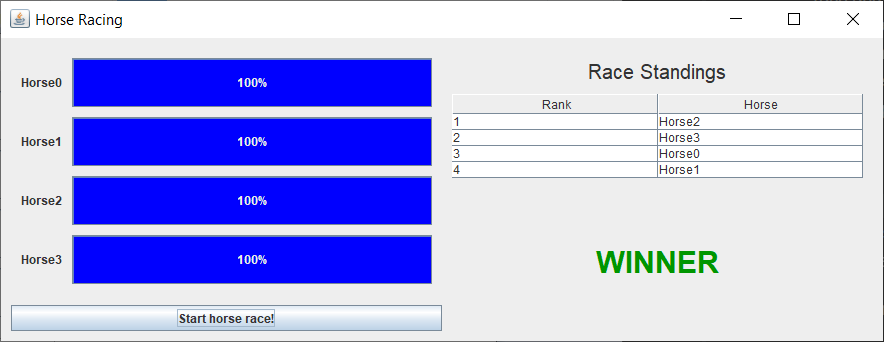

Exercise04
- Refactor code done in Exercise03 and add following features:
  - user is presented with the list of horses participating in the race
  and selects a horse to bet on
  - during the race a standings table is displayed and updating in real-time
  - when the race has finished a message is displayed 
    informing if the horse selected won or not

Requirements
- define `HorseListener` interface with methods for handling `HorseEvent`s
triggered during the race
- try to build the application following Observer pattern
    
Result of current implementation:

