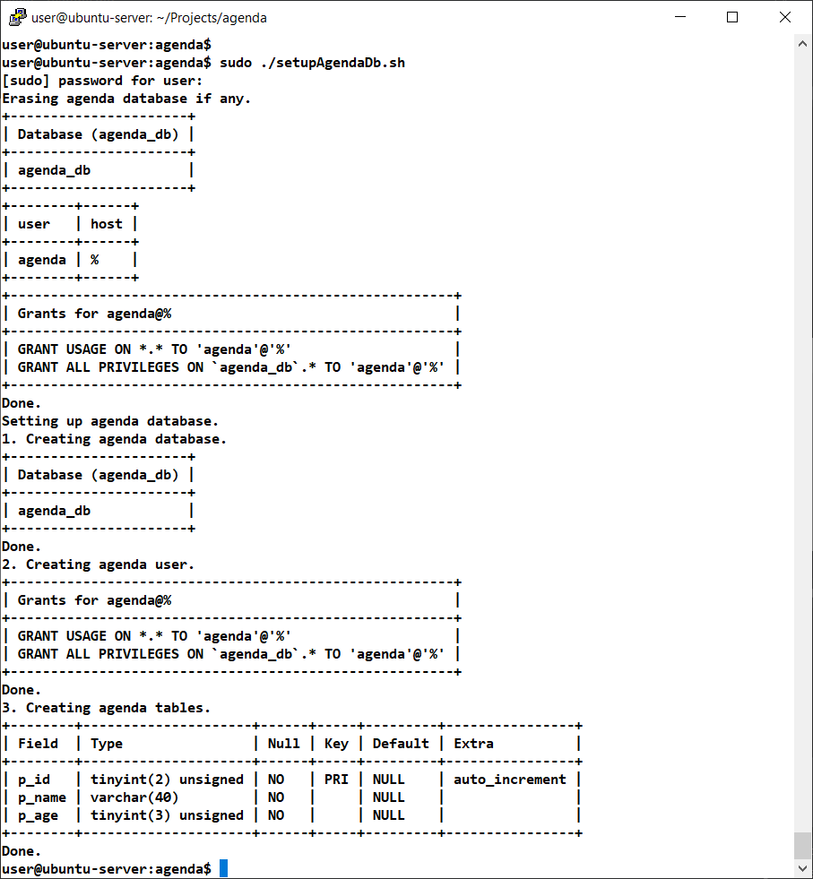
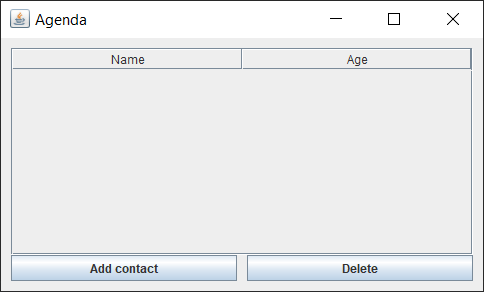
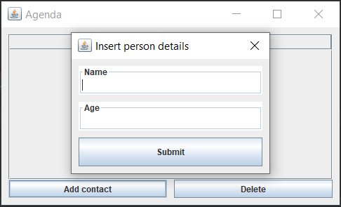
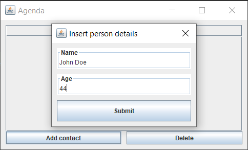
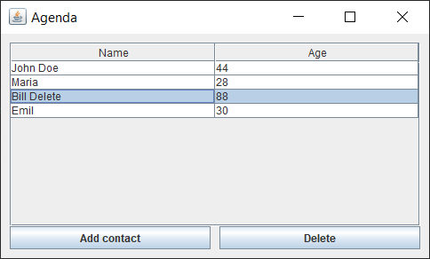
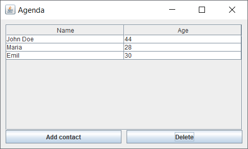

Exercise01
- Build a simple GUI application which allows inserting and deleting 
  persons detail records into a database similar to an agenda.

Requirements
  - `agenda_db`database will have a `person_t` table with bellow structure
    - `p_id` primary key
    - `p_name` is a `VARCHAR(40)` field
    - `p_age` is a `TINYINT(3)` field
    
Result of current implementation

