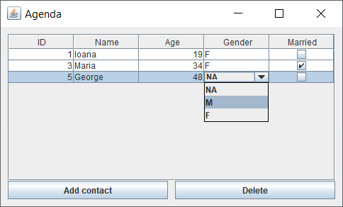
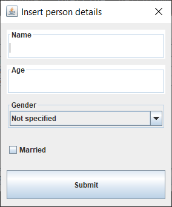
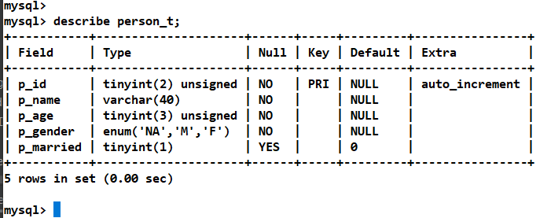

Exercise02

- Refactor most of the code done in [Exercise01](../exercise01) 
  and implement the following:
  - add two more columns to the `person_t` table on database side:
    - `p_gender` is an `ENUM` for person genders
    - `p_married` is a `BOOLEAN` for marital status
  - write a custom `TableModel` called `AgendaPersonTableModel` 
    which takes a `Connection` as argument in constructor 
    and uses an updatable `ResultSet` as model
  - what we want to achieve with this `AgendaPersonTableModel` 
    is that when user makes any changes on the GUI in the `AgendaPersonTable` 
    cells then those changes are also updated on the database side
  - in addition:
     - set the `CellEditor` for gender column in `AgendaPersonTable`
       to be a `JComboBox`
     - in `AgendaPersonTableModel` override `getColumnClass()` method
       to return `Boolean.class` for the married column; this will render 
       the cells in this column as checkboxes
        
Result of current implementation

